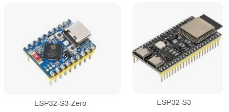
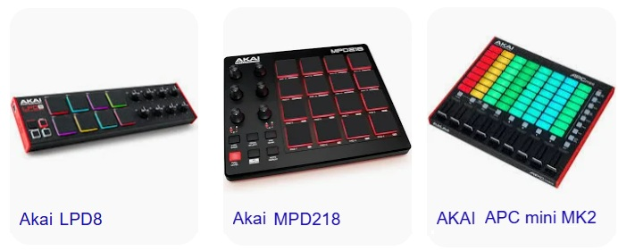
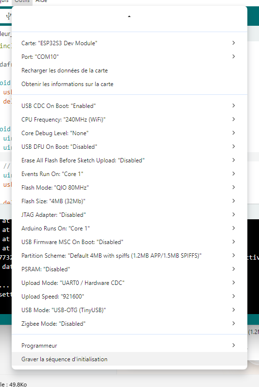

# 🎵 ESP32 USB‑C MIDI Note Sender

Ce guide explique comment comment programmer un ESP32 connecté en USB‑C afin d’envoyer une note MIDI.

# 📺 Vidéo

Lien Youtube: [https://www.youtube.com/@Baronnix/playlists](https://www.youtube.com/@Baronnix/playlists)

# 🧩 Objectif

Ce projet montre comment programmer un ESP32‑S2/S3 pour qu’il se comporte comme un périphérique MIDI USB, capable d’envoyer une note MIDI lorsqu’un événement se produit.
L’ESP32 apparaît comme un périphérique MIDI standard compatible Windows, macOS, Linux et tous les DAW.

Ce tutoriel fait partie d'une série dont le but est de créer un contrôleur midi avec une interface web afin de pouvoir envoyer piloter des applications supportant le midi de n'importe quel appareil connecté sur le même reseau Wifi que le contrôleur.

# 📦 Matériel nécessaire

 * ESP32‑S2 ou ESP32‑S3 avec USB‑C
 * Câble USB‑C
 * Un ordinateur (tutoriel réalisé sur Windows)



## 📁 Structure du projet

|F ichier ou adresse de dossier | Description                          |
|-------------------------------|--------------------------------------|
|/images                        | Images de ce fichier de turoriel     |
|/src                           | Code principal                       |
|README.md                      | Ce fichier de turoriel               |

# 🎹 Qu'est ce qu'un contrôleur MIDI

Un contrôleur MIDI peut servir à :
 * 🎵 faire de la musique
 * 💡 piloter des lumières
 * 🎥 contrôler un stream
 * ...

👉 C’est juste un contrôleur universel → tu lui assignes ce que tu veux.

## 🎛️ Examples de logiciels par application

 * 🎵 faire de la musique:
    * ⭐ DAW (logiciels complets de musique)
        * 🎹 Piano / composition → Logic Pro, Cubase
        * 🎧 Électro / live → Ableton Live
        * 🥁 Beats → FL Studio
    * 🆓 Logiciels gratuits (pour débuter)
        * GarageBand
        * Cakewalk
 * 💡 piloter des lumières
    * QLC+ (Logiciel gratuit)
 * 🎥 contrôler un stream
    * OBS Studio + MIDI2OBS

## 🎹 Examples de contrôleur MIDI

 * Akai APC Mini MK2
 * Akai LPD8 MKII
 * Akai MPD218
 * ...

 

## ⚙️ Comment ça marche (simple)

Ton contrôleur envoie un signal MIDI (USB)

Un logiciel reçoit ce signal

Tu fais un “mapping” → tu associes un bouton à une action

👉 On appelle ça souvent MIDI mapping / MIDI learn.

## 🧠 Exemple concret

* Bouton 1 → changer de scène (caméra → écran)
* Bouton 2 → mute micro
* Fader → volume du stream
* Pad → lancer un son / jingle

# 🔍 Pourquoi choisir un ESP32‑S2 ou ESP32‑S3 ?

Le choix de l’ESP32 n’est pas anodin : toutes les versions ne permettent pas d’envoyer du MIDI via USB.

Voici les raisons techniques qui justifient l’utilisation d’un ESP32‑S2 ou ESP32‑S3 :

## 1. USB natif intégré

Les modèles S2 et S3 possèdent un contrôleur USB OTG matériel, ce qui permet à la carte d’agir comme un périphérique USB (HID, MIDI, CDC…).

Les anciens ESP32 (WROOM, WROVER) n’ont pas cette capacité.

## 2. Compatibilité avec TinyUSB

TinyUSB est la bibliothèque qui permet de créer un USB MIDI Device.

Elle fonctionne parfaitement sur les ESP32‑S2/S3, ce qui simplifie énormément le développement.

## 3. Alimentation et communication via USB‑C

Le port USB‑C permet :
 * alimentation stable
 * programmation directe
 * communication MIDI sans adaptateur

compatibilité plug‑and‑play

## 4. Puissance et polyvalence
L’ESP32‑S3 offre :
 * un double cœur
 * du Bluetooth LE
 * plus de RAM
 * un support IA (instructions vectorielles)

Ce qui en fait un excellent choix pour un contrôleur MIDI avancé (pads, sliders, capteurs, synthèse…).

## 5. Disponibilité et prix

Les cartes ESP32‑S2/S3 sont :
 * faciles à trouver
 * peu coûteuses
 * bien documentées
 * supportées par Arduino et PlatformIO

 ## 6. Utiliser une carte ESP32‑S3 avec USB natif

C’est la vraie solution si tu veux faire un contrôleur MIDI USB.

Modèles compatibles :
 * ESP32‑S3 DevKitC‑1
 * ESP32‑S3 N8R8
 * LilyGO ESP32‑S3 Zero (version officielle)
 * UnexpectedMaker TinyS3 / FeatherS3
 * Waveshare ESP32‑S3
 * ...

Certaines cartes contiennent un convertisseur USB‑Série externe  
➡️ Donc TinyUSB ne peut pas s’activer  
➡️ Donc MIDI USB ne peut pas fonctionner  

Modèles compatibles :
 * ESP32‑S3 Zero
  * ...

# 🛠️ Environnement de développement et configuration de la carte

## 🧰 Choisir un environnement de développement (IDE)

Il existe plusieurs IDE, ci-dessous nous allons en comparer 2:
 * Arduino
 * PlatformIO

Pour le tutoriel nous utiliserons Arduino. 

### Arduino IDE (simple, débutants)

 * Installation rapide
 * Interface intuitive
 * Support officiel ESP32

👉 Recommandé si tu veux aller vite.

### PlatformIO (avancé, pro)

 * Intégré dans VS Code
 * Gestion propre des dépendances
 * Environnements multiples

👉 Recommandé pour un projet MIDI plus complexe.

## 🧩 Installation de Arduino IDE

Suivre les étapes suivantes:
1. Aller sur [https://www.arduino.cc/en/software/](https://www.arduino.cc/en/software/)
2. Télécharger Arduino IDE en cliquant sur le bouton "Download"
3. Installer Arduino IDE une fois le téléchargement terminé
4. Ouvrir Arduino IDE une fois le l'installation terminée

## 🧩 Installation ESP32 dans Arduino IDE

Suivre les étapes suivantes:
1. Aller dans Fichier → Préférences
2. Ajouter l’URL : [https://espressif.github.io/arduino-esp32/package_esp32_index.json](https://espressif.github.io/arduino-esp32/package_esp32_index.json)
3. Choisir le type de carte:  Outils → Type de carte → ESP32S3 Dev Module
4. Choisir le mode USB: Outils → USB Mode → USB OTG (TinyUSB)
5. Choisr l'USB firmware: Outils → USB CDC On Boot → Enabled



# 🔢 Programmation

## 🎼 Quelle librairie installer ?

Pour que l’ESP32 puisse se comporter comme un périphérique MIDI USB, il faut utiliser la librairie :
 * Adafruit TinyUSB Library

C’est elle qui permet :
 * la gestion du port USB natif
 * la création d’un périphérique MIDI
 * l’envoi de messages MIDI (Note On, Note Off, CC…)

👉 Elle est indispensable pour ce projet.

## 📥 Comment installer la librairie (Arduino IDE)

 * Méthode 1 — Installation automatique (recommandée)
    1. Ouvrir Arduino IDE
    2. Aller dans Outils → Gérer les bibliothèques…
    3. Chercher : Adafruit TinyUSB Library
    4. Cliquer sur Installer

C’est tout — Arduino IDE gère les dépendances automatiquement.

* Méthode 2 — Installation manuelle (si besoin)
    1. Aller sur le GitHub officiel de Adafruit TinyUSB: [https://github.com/Adafruit/adafruit_tinyusb_arduino](https://github.com/Adafruit/adafruit_tinyusb_arduino)
    2. Télécharger le ZIP
    3. Arduino IDE → Croquis → Inclure une bibliothèque → Ajouter la bibliothèque .ZIP
    4. Sélectionner le fichier ZIP

## 🧪 Vérifier que la librairie fonctionne

Dans ton code, tu dois pouvoir inclure :

```cpp
#include "Adafruit_TinyUSB.h"
```

Si aucune erreur n’apparaît → la librairie est bien installée.


## 🎹 Exemple de code : envoyer une note MIDI

Le code suivant envoi la note C4 toutes les 2 secondes environ

```cpp
#include "Adafruit_TinyUSB.h"

Adafruit_USBD_MIDI usb_midi;

void setup() {
  usb_midi.begin();
  delay(1000);
}

void loop() {
  uint8_t note = 60;      // C4
  uint8_t velocity = 100; // Vélocité

  // NOTE ON (canal 1 → 0x90)
  uint8_t msgOn[3] = {0x90, note, velocity};
  usb_midi.write(msgOn, 3);

  delay(500);

  // NOTE OFF (canal 1 → 0x80)
  uint8_t msgOff[3] = {0x80, note, velocity};
  usb_midi.write(msgOff, 3);

  delay(1000);
}
```

# 🔥 Compilation & Flashage

## 🧪 Compilation

Dans Arduino IDE :
1. Sélectionner la carte ESP32‑S2/S3
2. Sélectionner le port USB‑C
3. Cliquer sur Vérifier pour compiler

Dans PlatformIO :
1. Ouvrir le projet
2. Cliquer sur Build

## ⚡ Flashage de l’ESP32

Dans Arduino IDE: 
1. Brancher l’ESP32 en USB‑C
2. Outils → Port → sélectionner le port
3. Cliquer sur Téléverser

Dans PlatformIO: 
1. Cliquer sur Upload
Remarque: PlatformIO détecte automatiquement le port USB

Si l’ESP32 ne flashe pas :
 * Maintenir BOOT enfoncé au démarrage
 * Essayer un autre câble USB‑C
 * Vérifier que TinyUSB est activé

# 🎛️ Tester avec MIDI Monitor ou MIDI View

Il existe plusieurs application pour recevoir et afficher les notes, ci-dessous nous allons en comparer 2:
 * MIDI Monitor (macOS)
 * MIDI View (Windows / Linux / macOS — MIDI View)

 Nous utiliserons MIDI View dans ce tutoriel

## 🖥️ macOS — MIDI Monitor

Suivre les étapes suivantes:
1. Télécharger MIDI Monitor
2. Lancer l’application
3. Brancher l’ESP32
4. Sélectionner ESP32 MIDI Device
5. Observer les messages Note On / Note Off

→ Ouvrir MIDI Monitor

## 🪟 Windows / Linux / macOS — MIDI View

Suivre les étapes suivantes:
1. Télécharger MIDI View: [https://hautetechnique.com/midi/midiview/](https://hautetechnique.com/midi/midiview/)
2. Lancer l’application téléchargée
3. Brancher l’ESP32
4. Ouvrir MIDI View
5. Sélectionner ESP32 MIDI Device dans la liste
6. Les messages MIDI apparaissent en temps réel

# 🔧 Extensions possibles

Il est possible d'ajouter de nombreuses fonctionnalitées suite a ce tutoriel commes:
 * Déclenchement par bouton
 * Envoyer plusieurs notes
 * Ajouter un interface web
 * ...

# 🎼 Récapitulatif : Notes MIDI, noms réels et valeurs (TinyUSB / MIDI Standard)

TinyUSB utilise les valeurs MIDI standard :
 * 0 → C‑1
 * 60 → C4 (Do central)
 * 127 → G9


## 🎹 Notes MIDI principales (octave centrale et repères)

| [Nom](ca://s?q=note_MIDI_nom) | [Nom FR](ca://s?q=note_MIDI_nom_FR) | [Valeur MIDI](ca://s?q=valeur_note_MIDI) | [Octave](ca://s?q=octave_MIDI) |
|-------------------------------|--------------------------------------|-------------------------------------------|--------------------------------|
| [C4](ca://s?q=note_C4)        | Do                                   | 60                                        | 4                              |
| [C#4](ca://s?q=note_C%23_4)   | Do# / Réb                            | 61                                        | 4                              |
| [D4](ca://s?q=note_D4)        | Ré                                   | 62                                        | 4                              |
| [D#4](ca://s?q=note_D%23_4)   | Ré# / Mib                            | 63                                        | 4                              |
| [E4](ca://s?q=note_E4)        | Mi                                   | 64                                        | 4                              |
| [F4](ca://s?q=note_F4)        | Fa                                   | 65                                        | 4                              |
| [F#4](ca://s?q=note_F%23_4)   | Fa# / Solb                           | 66                                        | 4                              |
| [G4](ca://s?q=note_G4)        | Sol                                  | 67                                        | 4                              |
| [G#4](ca://s?q=note_G%23_4)   | Sol# / Lab                           | 68                                        | 4                              |
| [A4](ca://s?q=note_A4)        | La (440 Hz)                          | 69                                        | 4                              |
| [A#4](ca://s?q=note_A%23_4)   | La# / Sib                            | 70                                        | 4                              |
| [B4](ca://s?q=note_B4)        | Si                                   | 71                                        | 4                              |


👉 La note A4 (La 440 Hz) est la référence internationale → MIDI 69

## 🧩 Récapitulatif complet des octaves MIDI
Octave	Note C (Do)	Valeur MIDI
| [Octave](ca://s?q=octave_MIDI) | [Note C (Do)](ca://s?q=note_C_octave) | [Valeur MIDI](ca://s?q=valeur_note_MIDI) |
|--------------------------------|----------------------------------------|-------------------------------------------|
| [C‑1](ca://s?q=octave_C-1)     | Do‑1                                   | 0                                         |
| [C0](ca://s?q=octave_C0)       | Do0                                    | 12                                        |
| [C1](ca://s?q=octave_C1)       | Do1                                    | 24                                        |
| [C2](ca://s?q=octave_C2)       | Do2                                    | 36                                        |
| [C3](ca://s?q=octave_C3)       | Do3                                    | 48                                        |
| [C4](ca://s?q=octave_C4)       | Do4 (Do central)                       | 60                                        |
| [C5](ca://s?q=octave_C5)       | Do5                                    | 72                                        |
| [C6](ca://s?q=octave_C6)       | Do6                                    | 84                                        |
| [C7](ca://s?q=octave_C7)       | Do7                                    | 96                                        |
| [C8](ca://s?q=octave_C8)       | Do8                                    | 108                                       |
| [C9](ca://s?q=octave_C9)       | Do9                                    | 120                                       |

## 🎼 Tous les Status Bytes importants

Voici le tableau complet des messages MIDI de base:

| [Message](ca://s?q=message_MIDI) | [Code Hex](ca://s?q=code_hex_MIDI) | [Canal 1](ca://s?q=canal_MIDI_1) | [Canal 16](ca://s?q=canal_MIDI_16) | [Description](ca://s?q=description_message_MIDI) |
|----------------------------------|-------------------------------------|-----------------------------------|------------------------------------|--------------------------------------------------|
| [Note Off](ca://s?q=note_off_midi) | 8n | 0x80 | 0x8F | Relâche une note |
| [Note On](ca://s?q=note_on_midi) | 9n | 0x90 | 0x9F | Joue une note |
| [Poly Aftertouch](ca://s?q=poly_aftertouch_midi) | An | 0xA0 | 0xAF | Pression par note |
| [Control Change](ca://s?q=control_change_midi) | Bn | 0xB0 | 0xBF | Contrôleurs (potentiomètres, sliders…) |
| [Program Change](ca://s?q=program_change_midi) | Cn | 0xC0 | 0xCF | Change de programme / instrument |
| [Channel Pressure](ca://s?q=channel_pressure_midi) | Dn | 0xD0 | 0xDF | Aftertouch global |
| [Pitch Bend](ca://s?q=pitch_bend_midi) | En | 0xE0 | 0xEF | Bend ±8192 |

## 🎛️  Structure d’un message MIDI

Un message MIDI standard (Note On / Note Off) contient 3 octets :

| [Octet](ca://s?q=octet_message_MIDI) | [Nom](ca://s?q=nom_octet_MIDI) | [Description](ca://s?q=description_octet_MIDI) | [Exemple](ca://s?q=exemple_message_MIDI) |
|--------------------------------------|--------------------------------|------------------------------------------------|-------------------------------------------|
| [1](ca://s?q=octet_1_MIDI) | Status Byte | Type de message + canal MIDI | 0x90 = Note On canal 1 |
| [2](ca://s?q=octet_2_MIDI) | Data Byte 1 | Numéro de note (0–127) | 60 = C4 (Do central) |
| [3](ca://s?q=octet_3_MIDI) | Data Byte 2 | Vélocité (0–127) | 100 = intensité |

Explication rapide:
 * Octet 1 : Status Byte  
     * Définit le type de message MIDI (Note On, Note Off, CC…) et le canal.
     * Exemple:
         * 0x90 = Note On canal 1
         * 0x80 = Note Off canal 1
 * Octet 2 : Data Byte 1  
     * Contient la note MIDI (0–127).
     * Exemple : 60 = C4.
 * Octet 3 : Data Byte 2  
     * Contient la vélocité (0–127).
    * Exemple : 100 = forte intensité.

## 🎛️ Comment TinyUSB utilise ces valeurs ?

Dans TinyUSB, tu envoies une note ainsi :

```cpp
  uint8_t msgOn[3] = {0x90, 60, 100};
  usb_midi.write(msgOn, 3);
  uint8_t msgOff[3] = {0x80, 60, 100};
  usb_midi.write(msgOff, 3);
```

Remarque: le 3 signifie dans la method write c'est le nombre d’octets (bytes) envoyé dans le message MIDI.

Un message MIDI standard (Note On / Note Off) contient toujours 3 octets

Les paramètres sont :
 * Status Byte 
 * Numéro de note MIDI (0–127)
 * Vélocité (0–127)

Tu peux donc envoyer n’importe quelle note en utilisant les tableaux ci‑dessus.