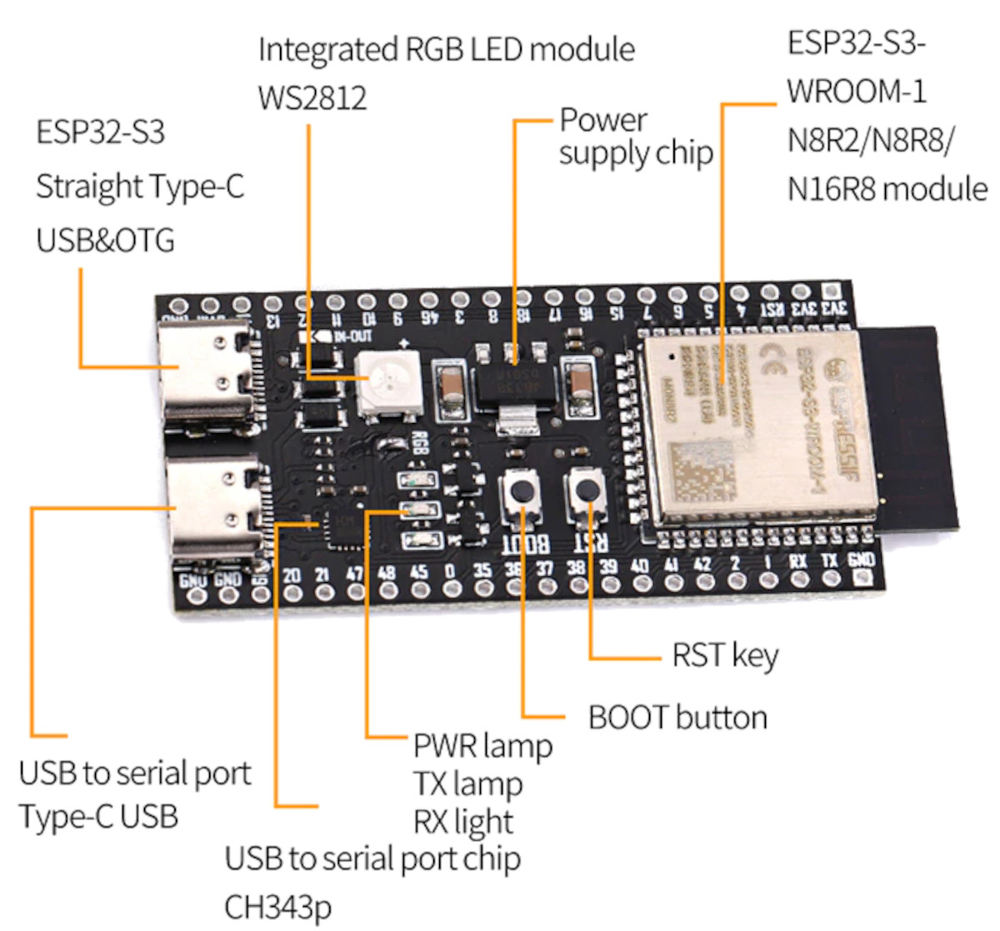

# 🎵 ESP32‑S3 USB‑MIDI avec ESP‑IDF

# 🎯 Objectif

Ce guide explique toutes les étapes nécessaires pour développer un périphérique USB‑MIDI sur ESP32‑S3 en utilisant :
* Visual Studio Code
* ESP‑IDF
* TinyUSB (inclus dans ESP‑IDF)
* Exemple MIDI officiel d’Espressif
Il couvre l’installation, la configuration, la création du projet, l’activation de TinyUSB, le build et le flash.

# 📺 Vidéo

Lien Youtube: [https://www.youtube.com/@Baronnix/playlists](https://www.youtube.com/@Baronnix/playlists)

# 🧰 1. Installation des outils

## 1.1 Installer Visual Studio Code

1. Télécharger VS Code :
    * https://code.visualstudio.com
    * Installer l’extension ESP‑IDF (officielle Espressif)
2. Dans VS Code : Extensions → Rechercher “ESP-IDF” → Installer

## 1.2 Installer ESP‑IDF (méthode recommandée)

1. Dans VS Code: Ctrl + Shift + P → ESP-IDF: Install ESP-IDF Tools
2. Choisir :
    * Version recommandée : ESP‑IDF v5.1 ou v5.2 (TinyUSB stable)
    * Plateforme : Windows
    * Installer Python, Git, Ninja, CMake automatiquement

ESP‑IDF sera installé dans: C:\Espressif\frameworks\esp-idf-<version>\

# 🔌 2. Préparer l’environnement ESP32‑S3

## 2.1 Choisir la bonne carte

TinyUSB fonctionne uniquement sur :
* ESP32‑S2
* ESP32‑S3
* ESP32‑C3 (partiel)



## 2.2 Sélectionner la cible ESP32‑S3

1. Dans VS Code : Ctrl + Shift + P → ESP-IDF: Set Target
2. Choisir : esp32s3

# 📁 3. Créer un nouveau projet ESP‑IDF

## 3.1 Créer un projet propre

1. Dans VS Code : Ctrl + Shift + P → ESP-IDF: New Project
2. Choisir l’exemple : usb/device/tusb_midi
3. Choisir un dossier propre, sans espaces ni accents : C:\esp\usb_midi_controller

Remarque: Si l’exemple n’apparaît pas, choisir : get-started/hello_world

Puis ajouter TinyUSB manuellement (section suivante).

# 🎹 4. Activer TinyUSB dans menuconfig

1. Dans ton projet :
```bash
idf.py menuconfig
```
Ou: Ctrl + Shift + P → ESP-IDF: Open Classic Menuconfig Terminal
2. Puis Component config → TinyUSB
3. Dans le menu choisir: 
     * [*] Enable TinyUSB device stack
     * [*] Enable MIDI device class

Si ce menu n’apparaît pas :
 * La cible n’est pas ESP32‑S3
 * Ton ESP‑IDF est incomplet
 * Ton projet n’est pas un projet ESP‑IDF valide

# 🧩 5. Ajouter TinyUSB dans CMakeLists.txt

Dans : main/CMakeLists.txt
Ajouter : 
```c
idf_component_register(
    SRCS "main.c"
    INCLUDE_DIRS "."
    REQUIRES tinyusb
)
```

Cela indique à ESP‑IDF que ton projet dépend de TinyUSB.

# 🎼 6. Exemple de code USB‑MIDI minimal

#include "tinyusb.h"
#include "class/midi/midi_device.h"

```c
void app_main(void)
{
    tinyusb_config_t tusb_cfg = {
        .device_descriptor = NULL,
        .string_descriptor = NULL,
        .external_phy = false
    };

    tinyusb_driver_install(&tusb_cfg);

    while (1) {
        uint8_t note_on[3] = {0x90, 60, 127};   // Note ON C4
        tud_midi_stream_write(0, note_on, 3);

        vTaskDelay(pdMS_TO_TICKS(2000));

        uint8_t note_off[3] = {0x80, 60, 0};    // Note OFF C4
        tud_midi_stream_write(0, note_off, 3);

        vTaskDelay(pdMS_TO_TICKS(2000));
    }
}
```

# ⚙️ 7. Compiler le projet

Dans VS Code : Icône Build  
Ou: 
```bash
idf.py build
```
Ou: Ctrl + Shift + P → ESP-IDF: Build, Flash and Start a Monitor on Your Device

Remarque: Cette dernière possibilité flash l'ESP32‑S3 après lea compilation

# 🔥 8. Flasher l’ESP32‑S3

1. Brancher l’ESP32‑S3 en USB‑C.
2. Dans VS Code : Icône Flash  
Ou:
```bash
idf.py -p COMx flash
```

# 🧪 9. Vérifier que le périphérique USB‑MIDI fonctionne

## 9.1 Détection du périphérique USB‑MIDI par Windows

Sur Windows :
1. Ouvrir Gestionnaire de périphériques
2. Aller dans Périphériques USB
3. Tu dois voir : TinyUSB MIDI Device dans "Vidéo, Audio et Jeux"

## 9.2 Tester avec MIDI Monitor ou MIDI View

Il existe plusieurs application pour recevoir et afficher les notes, ci-dessous nous allons en comparer 2:
 * MIDI Monitor (macOS)
 * MIDI View (Windows / Linux / macOS — MIDI View)

 Nous utiliserons MIDI View dans ce tutoriel

## 🪟 Windows / Linux / macOS — MIDI View

Suivre les étapes suivantes:
1. Télécharger MIDI View: [https://hautetechnique.com/midi/midiview/](https://hautetechnique.com/midi/midiview/)
2. Lancer l’application téléchargée
3. Brancher l’ESP32
4. Ouvrir MIDI View
5. Sélectionner TinyUSB MIDI Device dans la liste
6. Les messages MIDI apparaissent en temps réel
