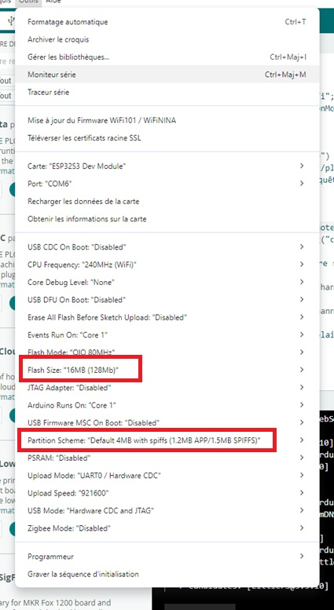
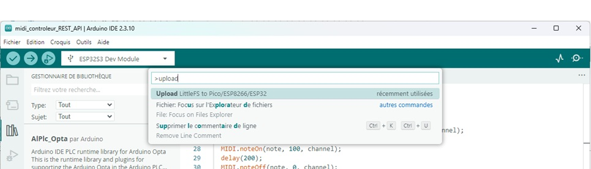

# 🎹 Interface Web + LittleFS + API MIDI sur ESP32‑S3

Ce tutoriel ajoute une interface Web à ton projet ESP32‑S3 Arduino IDE 2.3, avec :
* Une page HTML séparée dans /data/index.html
* Upload dans LittleFS 
* Boutons pour jouer des notes via l’API /playNote
* Le code complet côté ESP32
* Les étapes de flashage (code + LittleFS )

# 📺 Vidéo

Lien Youtube: [https://www.youtube.com/watch?v=PnMmg08P6Bs](https://www.youtube.com/watch?v=PnMmg08P6Bs)

# 📦 Prérequis

* Carte ESP32‑S2 / ESP32‑S3 compatible TinyUSB (Dans ce tutoriel on utilise la carte ESP32‑S3 DevKit C1)
* Câble USB‑C
* Un ordinateur (tutoriel réalisé sur Windows)
* Arduino IDE installé
* esp32 installé dans le gestionnaire de cartes (esp32 par Espressif Systems - 3.3.10)

Ce tutoriel repart du code final du tutoriel [02 - ESP32 Arduino - USB‑C MIDI Controleur - Ajout Server Web local](https://github.com/Baronnix/ESP32/tree/main/Controleur%20Midi/02%20-%20ESP32%20Arduino%20-%20USB%E2%80%91C%20MIDI%20Controleur%20-%20Ajout%20Server%20Web%20local)

Lien Youtube tutoriel précédent: [https://www.youtube.com/watch?v=u2ZS3cqmaGg](https://www.youtube.com/watch?v=u2ZS3cqmaGg)

# Dependances et Versions

* Arduino IDE - 2.3.10
* Arduino Plugins:
  * arduino-littlefs-upload - 1.6.3
* Cartes:
  * esp32 par Espressif Systems - 3.3.10

# 📁 LittleFS : Description, avantages, inconvénients, utilisation et setup

## 🧩 1. Qu’est‑ce que LittleFS  ?

LittleFS (lightweight filesystem) est un système de fichiers embarqué stocké directement dans la mémoire flash interne de l’ESP32.

Il permet de stocker :
* Pages HTML
* CSS / JS
* Images légères
* Fichiers de configuration
* Petites bases de données
* Fichiers JSON

LittleFS est monté comme un mini‑disque accessible via LittleFS.open().

## ⭐ 2. Avantages de LittleFS

* Aucun matériel externe: Pas besoin de carte SD, de lecteur, de câblage, de gestion SPI externe.
* Ultra rapide: Lecture/écriture directement dans la flash → beaucoup plus rapide qu’une carte SD.
* Idéal pour les fichiers statiques: Pages web, assets, presets, configurations.
* Fiable: Pas de faux contacts, pas de carte mal insérée, pas de corruption due à un retrait.
* Intégré dans l’IDE: Upload simple via ESP32 Sketch Data Upload.
* Sécurisé: Impossible à retirer physiquement → parfait pour des interfaces web embarquées.

## ⚠️ 3. Inconvénients de LittleFS

* Taille limitée: En général, LittleFS fait entre 1 Mo et 2 Mo maximum car la mémoire flash est partagée entre :
    * Bootloader
    * Partition app
    * OTA
    * NVS
    * LittleFS 
* Pas adapté aux gros fichiers: Éviter :
    * Vidéos
    * Images lourdes
    * Gros logs
    * Bases de données volumineuses
* Nombre limité d’écritures
    * Comme toute mémoire flash, elle s’use.
    * Pour des logs intensifs → préférer une SD.

## 🔄 4. Comparaison LittleFS et Carte SD

| Critère | LittleFS | Carte SD |
|--------------------------------------|------------------------------------------------|------------------------------------------------|
| Matériel | Aucun | Nécessite lecteur SD + câblage |
| Vitesse | Très rapide | Moyenne |
| Taille | 1–2 Mo | 2 Go à 128 Go |
| Fiabilité | Très haute | Dépend de la carte |
| Retrait possible | Non | Oui |
| Complexité | Très simple | Plus complexe |
| Usage idéal | Pages web, configs | Gros médias, gros logs |

## 🛠️ 5. Comment utiliser LittleFS dans un projet ESP32

1. Activer LittleFS dans le code
```cpp
#include <LittleFS.h>

void setup() {
  if (!LittleFS.begin(true)) {
    Serial.println("❌ Erreur LittleFS");
    return;
  }
  Serial.println("📁 LittleFS monté");
}
```

2. Lire un fichier
```cpp
File file = LittleFS.open("/index.html", "r");
server.streamFile(file, "text/html");
file.close();
```

3. Écrire un fichier (rarement conseillé)
```cpp
File file = LittleFS.open("/config.json", "w");
file.print("{\"channel\":1}");
file.close();
```

## 📁 6. Structure du projet

Créer le dossier /data dans le dossier du projet. Tous les fichiers contenus dans ce dossier seront chargés dans LittleFS.

Ton dossier Arduino doit ressembler à ceci :
```
MonProjet/
 ├── MonProjet.ino
 ├── data/
 │    └── index.html
```
Le fichier index.html sera envoyé dans LittleFS via l’outil ESP32 Sketch Data Upload.

## 📥 7. Installer le plugin arduino-littlefs-upload

Il faut ajouter l'extension VS Code Arduino “arduino-littlefs-upload”, Arduino IDE 2.3 ne l’installe pas automatiquement.

1. Va sur la page des releases et clique sur le fichier .vsix pour le télécharger: https://github.com/earlephilhower/arduino-littlefs-upload/releases
2. Sur ton ordinateur, va dans le dossier suivant : C:\Users\\<nom_utilisateur>\\.arduinoIDE\
3. Crée un nouveau dossier appelé plugins si ce n’est pas déjà fait.
4. Déplace le fichier .vsix que tu as téléchargé dans le dossier plugins (supprime toute ancienne version du même plugin si nécessaire).
5. Redémarre ou ouvre Arduino IDE 2.
Pour vérifier si le plugin a été installé avec succès, appuie sur Ctrl + Shift + P pour ouvrir la palette de commandes.

Une instruction appelée Upload Little FS to Pico/ESP8266/ESP32 devrait apparaître (descends dans la liste ou recherche son nom).

## 📥 8. Envoyer des fichiers dans le système de fichiers LittleFS de l’ESP32

Pour envoyer des fichiers dans le système de fichiers LittleFS de l’ESP32:
1. Dans le dossier data, tu dois placer les fichiers que tu veux téléverser dans le système de fichiers de l’ESP32.
2. Assure‑toi d’avoir sélectionné la bonne carte (Outils > Carte) et le bon port COM (Outils > Port).
3. Selon la carte ESP32 choisie, tu devras peut‑être sélectionner la taille de la mémoire flash.
4. Ensuite, téléverse les fichiers sur la carte ESP32: Appuie sur Ctrl + Shift + P (sous Windows)
5. Cherche la commande Upload LittleFS to Pico/ESP8266/ESP32 et clique dessus.
6. Après quelques secondes, tu devrais voir le message : “Completed upload.”  
Les fichiers ont été téléversés avec succès dans le système de fichiers de l’ESP32.

# 🌐 Page Web à mettre dans /data/index.html

Voici une page simple avec des boutons pour jouer des notes :

⚠️ Tu peux modifier les notes, styles, channels, etc.

Il est à noter que la variable "base_url" permet de tester la page Web en local sur l'ordinateur sans charger chaque changement sur LittleFS

```html
<!DOCTYPE html>
<html>
<head>
  <meta charset="UTF-8">
  <title>ESP32 MIDI Controller</title>
  <style>
    body { font-family: Arial; background:#f0f0f0; padding:20px; }
    h1 { text-align:center; }
    .note-btn {
      padding:15px 25px;
      margin:10px;
      font-size:20px;
      background:#4CAF50;
      color:white;
      border:none;
      border-radius:8px;
      cursor:pointer;
    }
    .note-btn:hover {
      background:#45a049;
    }
  </style>
</head>
<body>
  <h1>🎹 ESP32 MIDI Web Controller</h1>

  <div id="buttons"></div>

  <script>
	//const base_url = "http://midiserver.local"; // Valeur pour une page web stockée sur l'ordinateur. L'adresse du controleur sur le reseau est nécessaire.
	const base_url = ""; // Valeur pour une page web stockée sur LittleFS. L'adressedu controleur est connue puisque la page est ouverte depuis ce dernier.
    
	const notes = [
      {name:"C4", value:60},
      {name:"D4", value:62},
      {name:"E4", value:64},
      {name:"F4", value:65},
      {name:"G4", value:67},
      {name:"A4", value:69},
      {name:"B4", value:71},
      {name:"C5", value:72}
    ];

    const channel = 1;

    const container = document.getElementById("buttons");

    notes.forEach(n => {
      const btn = document.createElement("button");
      btn.className = "note-btn";
      btn.innerText = n.name;
      btn.onclick = () => {
        fetch(`${base_url}/playNote?note=${n.value}&channel=${channel}`)
          .then(r => r.text())
          .then(t => console.log(t));
      };
      container.appendChild(btn);
    });
  </script>
</body>
</html>
```

# 🧩 Code complet ESP32‑S3 

Voici le code complet mis à jour pour arduino:

```cpp
#include "USB.h"
#include "USBMIDI.h"
#include <WiFi.h>
#include <WebServer.h>
#include <ESPmDNS.h>
#include <LittleFS.h>

USBMIDI MIDI;
WebServer server(80);

// --- CONFIG WIFI ---
const char* ssid = "MonWifi";
const char* password = "MonMotDePasse";

// --- API /playNote ---
void handlePlayNote() {
  if (!server.hasArg("note") || !server.hasArg("channel")) {
    server.send(400, "text/plain", "Missing note or channel");
    Serial.println("⚠️ Requête invalide : paramètres manquants");
    return;
  }

  int note = server.arg("note").toInt();
  int channel = server.arg("channel").toInt();

  Serial.printf("🎵 Lecture note=%d channel=%d\n", note, channel);

  MIDI.noteOn(note, 100, channel);
  delay(200);
  MIDI.noteOff(note, 0, channel);

  server.send(200, "text/plain", "Note played");
}

// --- PAGE WEB ---
void handleRoot() {
  File file = LittleFS.open("/index.html", "r");
  if (!file) {
    server.send(500, "text/plain", "index.html missing");
    return;
  }
  server.streamFile(file, "text/html");
  file.close();
}

void setup() {
  USB.begin();
  Serial.begin(115200);
  delay(1000);

  Serial.println("=== USB MIDI + WebServer + mDNS + LittleFS ===");

  // --- LittleFS ---
  if (!LittleFS.begin(true)) {
    Serial.println("❌ Erreur LittleFS");
    return;
  }
  Serial.println("📁 LittleFS monté");

  // --- WIFI ---
  Serial.println("Connexion au WiFi...");
  WiFi.begin(ssid, password);
  while (WiFi.status() != WL_CONNECTED) {
    delay(200);
    Serial.print(".");
  }

  Serial.println("\n📶 WiFi connecté !");
  Serial.print("📡 IP locale : ");
  Serial.println(WiFi.localIP());

  // --- mDNS ---
  if (!MDNS.begin("midiserver")) {
    Serial.println("❌ Erreur : mDNS non démarré");
  } else {
    Serial.println("📛 Nom mDNS actif : midiserver.local");
    Serial.println("🌐 URL API : http://midiserver.local/playNote?note=60&channel=1");
    Serial.println("🌐 Interface : http://midiserver.local/");
  }

  // --- ROUTES ---
  server.on("/", handleRoot);
  server.on("/playNote", handlePlayNote);

  server.begin();
  Serial.println("🚀 Serveur Web démarré !");
}

void loop() {
  server.handleClient();
}
```

# 🧩 Configuration du projet dans Arduino IDE

1. Créer un nouveau croquis: Fichier → Nouveau croquis
2. Aller dans Fichier → Enregistrer sous...
3. Choisir un dossier dont le chemin ne contient pas de caractères spéciaux
4. Choisir un nom sans espaces ni caractères spéciaux
5. Confirmer
6. Un nouveau croquis est créé, vérifier que le fichier et le nom de dossier créés correspondent
7. Coller le code complet
8. Modifer les variables concernant le réseau Wifi

# 🔥 Flashage complet (Arduino IDE 2.3)

## 🧩 1. Vérifier la mémoire réelle de ton ESP32‑S3

Recherche la version de ton ESP32S3, par exemple si ton module est un ESP32-S3-N16R8, le nom se lit comme ceci :
* N16 → 16 MB de flash NOR
* R8 → 8 MB de PSRAM

Donc ton module possède :
* Flash : 16 MB (128 Mbit)
* PSRAM : 8 MB

Ce que ça implique pour Arduino IDE:
* Dans Outils → Flash Size, tu devrais choisir l'option 16MB

Si tu vois 8MB ou 32MB, ce n’est pas le bon réglage pour ton module.

Remarque: Tu peux confirmer dans le code :
```cpp
#include "esp_flash.h"

void setup() {
  Serial.begin(115200);
  uint32_t size;
  esp_flash_get_size(NULL, &size);
  Serial.printf("Flash size: %u MB\n", size / (1024 * 1024));
}

void loop() {}
```
Tu devrais obtenir : 
  * Flash size: 16 MB

## 🧱 2. Choisir le schéma de partition

📌 Pour un projet Web (HTML/CSS/JS/images)

Le meilleur choix : Tools → Partition Scheme → Default 4MB with SPIFFS

Cela donne :
| Partition | Taille |
|--------------------|---------------------------|
| Application (firmware) | ~1.3 MB |
| LittleFS (SPIFFS) |	~1.5 MB |
| OTA	 | Oui |

La somme des tailles des fichiers à charger dans LittleFS devra donc se limiter à la contenance.



Commencez par quelque chose de simple, et testez avec les options de partition si besoin de plus de taille jusqu'à la limite de l'ESP32.

## 📁 3. Préparer les fichiers Web dans /data

Mettre le code html dans le dossier data.
Ton projet Arduino devrait ressembler à:
```
/ton_projet/
    /src
    /data   ← mettre ici HTML, CSS, JS, images
    ton_projet.ino
```

Exemples de fichiers :
* index.html
* style.css
* script.js
* logo.png (léger)

## 🔥 4. Flasher LittleFS

1. Fermer le monitor série dans Arduino
2. Branche l'ESP32S3 devkit sur le port USB-TTL
3. Redémarre l'ESP32S3 devkit en mode flashage (bouton BOOT maintenu appuyé + et appui court sur bouton RESET)
4. Choisit le bon port COM (série)
5. Appuie sur Ctrl + Shift + P (Windows)
6. Tape/cherche : Upload LittleFS to Pico/ESP8266/ESP32
7. Clique sur : Upload LittleFS to Pico/ESP8266/ESP32
  
8. Attends le message : Completed upload.
Les fichiers sont maintenant dans la flash.

## ⚙️ 5. Flasher le code (Sketch)

Dans Arduino IDE: Sketch → Upload

Cela flashe uniquement le firmware, pas le filesystem.

# 🧪 Tester

1. Branche l'ESP32S3 devkit sur le port USB-OTG
2. Ouvre Midi View
3. Ouvre ton navigateur
4. Va à l'adresse: http://midiserver.local/
Tu verras les boutons :
* C4
* D4
* E4
* F4
* G4
* A4
* B4
* C5
5. Clique sur un bouton et vérifie dans Midi View que la note eest bien reçue.

