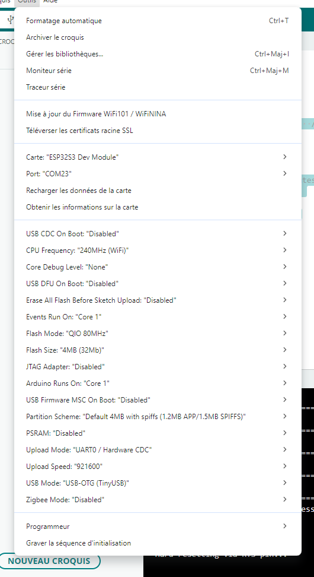

# 🎹 Serveur Web + API REST + USB MIDI + USB Serial + mDNS

Ce tutoriel transforme un ESP32‑S2 ou ESP32‑S3 en :
* Interface MIDI USB
* Serveur Web local
* API REST pour jouer des notes MIDI
* Nom mDNS (ex: midiserver.local)
* Logger USB Serial (CDC)

Tu pourras envoyer une note MIDI via :
[http://midiserver.local/playNote?note=60&channel=1](http://midiserver.local/playNote?note=60&channel=1)

# 📦 Prérequis

* Carte ESP32‑S2 / ESP32‑S3 compatible TinyUSB (Dans ce tutoriel on utilise la carte ESP32‑S3 DevKit C1)
* Câble USB‑C
* Un ordinateur (tutoriel réalisé sur Windows)
* Arduino IDE installé
* esp32 installé dans le gestionnaire de cartes (esp32 par Espressif Systems - 3.3.10)

Ce tutoriel repart du code final du tutoriel [01 - ESP32 Arduino - USB‑C MIDI Controleur - Premiere Programmation](https://github.com/Baronnix/ESP32/tree/main/Controleur%20Midi/01%20-%20ESP32%20Arduino%20-%20USB%E2%80%91C%20MIDI%20Controleur%20-%20Premiere%20Programmation)

# 🧩 Fonctionnalités du projet

* USB MIDI activé via TinyUSB
* Serveur Web HTTP sur port 80
* API REST /playNote
* Paramètres GET : note et channel
* Nom mDNS : midiserver.local
* Logs sur USB Serial (CDC)
* Affichage de l’IP et des URLs dans le moniteur série Arduino

# 🛠️ Configuration du projet dans Arduino IDE

## 🧩 Configuration du projet dans Arduino IDE

1. Créer un nouveau croquis: Fichier → Nouveau croquis
2. Aller dans Fichier → Enregistrer sous...
3. Choisir un dossier dont le chemin ne contient pas de caractères spéciaux
4. Choisir un nom sans espaces ni caractères spéciaux
5. Confirmer
6. Un nouveau croquis est créé, vérifier que le fichier et le nom de dossier créés correspondent
7. Coller le code du tutoriel [01 - ESP32 Arduino - USB‑C MIDI Controleur - Premiere Programmation](https://github.com/Baronnix/ESP32/tree/main/Controleur%20Midi/01%20-%20ESP32%20Arduino%20-%20USB%E2%80%91C%20MIDI%20Controleur%20-%20Premiere%20Programmation) afin de repartir de cette version fonctionnelle.

## 🧩 Configuration de la carte dans Arduino IDE

1. Choisir le type de carte:  Outils → Type de carte → ESP32S3 Dev Module
2. Choisir le mode USB: Outils → USB Mode → USB OTG (TinyUSB)
3. Choisr l'USB firmware: Outils → USB CDC On Boot → Disabled



# 🖥️ Activer les logs série USB et écrire des logs

Le microcontrôleur utilisé (ESP32‑S2 / ESP32‑S3) possède un port USB natif.

Grâce à TinyUSB, ce port peut exposer plusieurs interfaces simultanément :
* USB MIDI
* USB CDC (Serial)
* HID, Mass Storage, etc.

Cela signifie que tu peux utiliser le moniteur série Arduino pour afficher des informations de debug.

## 🔧 Utilisation MIDI et Serial

Les ESP32‑S2/S3 ont un seul port USB physique, mais TinyUSB peut créer plusieurs interfaces logiques :
* Interface MIDI
* Interface CDC (Serial)
* Interface HID
* Interface Mass Storage
* etc.
Il est donc en théorie possible d'utiliser l'ESP32-S3 en tant que périphérique MIDI et récupérer les informations de debug par port Série.

Cependant l'ESP32‑S3 Dev Module ne peut pas exposer facilement CDC + MIDI en même temps dans la version esp32 core que l'on utilise (3.3.10) sous Arfuino IDE 2.3.

Ainsi, on utilisera les 2 ports (par alternance) de l'ESP32-S3 Dev Module suivant ce que l'on souhaite faire:
* USB-CDC: Pour afficher les informations de debug
* USB-OTG: Pour le comportement en contrôleur MIDI natif

Il semble être possible d'activer le MIDI et le Serial sur le même port OTG mais cela demande des modifier les libairies manuellement.

## 🔌 1. Activer le port série USB (CDC)

Pour activer les logs série, il suffit d’appeler :
```cpp
Serial.begin(115200);
```

Explication :
* Serial correspond à l’interface USB CDC, pas à un UART matériel.
* 115200 est la vitesse standard utilisée par le moniteur série Arduino.
* Une petite pause est utile pour laisser le temps au port USB de s’initialiser :
```cpp
delay(1000);
```

## 🖥️ 2. Afficher des logs dans le moniteur série

Une fois le port série activé, tu peux écrire des logs avec :
```cpp
Serial.println("Texte simple");
Serial.print("Valeur : ");
Serial.println(variable);
Serial.printf("Formaté : note=%d channel=%d\n", note, channel);
```
Les trois méthodes utiles :

| Méthode | Description |
|--------------------------------------|------------------------------------------------|
| Serial.print() | Affiche du texte sans retour à la ligne | 
| Serial.println() | Affiche du texte avec retour à la ligne |
| Serial.printf() | Formatage avancé (comme printf en C) |


## 📘 3. Ouvrir le moniteur série dans Arduino IDE

1. Modifie ton code
2. Compile et téléverse ton programme
3. Va dans : Outils → Moniteur Série
4. Choisis : 115200 bauds
5. Optionnellement reset la carte ESP32
6. Tu verras immédiatement les logs USB CDC
Exemple de sortie :
```bash
=== USB MIDI + WebServer + mDNS ===
📶 WiFi connecté !
📡 IP locale : 192.168.1.42
📛 Nom mDNS actif : midiserver.local
🌐 URL API : http://midiserver.local/playNote?note=60&channel=1
🚀 Serveur Web démarré !
🎵 Lecture note=60 channel=1
```

# 📡 Connexion WiFi, création du WebServer et définition de l’API /playNote

Cette section explique en détail comment fonctionne la partie réseau du projet :
* connexion au WiFi,
* création du serveur web,
* définition d’une API REST,
* extraction des paramètres GET,
* appel de la fonction qui joue une note MIDI.

## 🔌 1. Connexion au WiFi

La connexion au réseau WiFi se fait avec les fonctions classiques de l’ESP32 :
```cpp
WiFi.begin(ssid, password);
while (WiFi.status() != WL_CONNECTED) {
    delay(200);
    Serial.print(".");
}
```

Explication :
* WiFi.begin(ssid, password)  
    → démarre la connexion au réseau WiFi en utilisant le nom du réseau et le mot de passe.
* La boucle while attend que l’ESP32 soit connecté.
    Tant que l’état n’est pas WL_CONNECTED, on affiche un point dans le moniteur série.
* Une fois connecté, on peut récupérer l’adresse IP locale :
```cpp
Serial.println(WiFi.localIP());
```
Cette IP est utile pour accéder au serveur web.

## 🌐 2. Création du serveur Web

Le serveur web est créé avec la classe WebServer :
```cpp
WebServer server(80);
```

Explication :
* 80 est le port HTTP standard.
* Le serveur écoute les requêtes HTTP envoyées à l’ESP32.
* Il sera capable de répondre à des URLs comme : [http://192.168.1.42/playNote?note=60&channel=1](http://192.168.1.42/playNote?note=60&channel=1)

Pour démarrer le serveur :
```cpp
server.begin();
```

### 🧩 3. Définition de l’API /playNote

L’API est définie avec :
```cpp
server.on("/playNote", handlePlayNote);
```

Cela signifie :
* Quand quelqu’un appelle l’URL /playNote,
* La fonction handlePlayNote() est exécutée.

## 🧪 4. Lecture des paramètres GET

L’API accepte deux paramètres :
* note → numéro de note MIDI (0–127)
* channel → canal MIDI (1–16)

Exemple d’appel : /playNote?note=60&channel=1

Dans la fonction handlePlayNote() :
```cpp
int note = server.arg("note").toInt();
int channel = server.arg("channel").toInt();
```

Explication :
* server.arg("note") récupère la valeur du paramètre note passée dans l’URL.
* .toInt() convertit la chaîne en entier.

Si un paramètre manque, on renvoie une erreur HTTP 400 :
```cpp
server.send(400, "text/plain", "Missing note or channel");
```

## 🎵 5. Appel de la méthode qui joue la note MIDI
Une
 fois les paramètres récupérés, on appelle TinyUSB MIDI :
```cpp
MIDI.noteOn(note, 100, channel);
delay(200);
MIDI.noteOff(note, 0, channel);

Explication :
* noteOn() envoie la note MIDI USB
* 100 est la vélocité
* note est la valeur MIDI de la note
* channel est le canal MIDI
* noteOff() arrête la note

Le serveur renvoie ensuite une réponse HTTP :
```cpp
server.send(200, "text/plain", "Note played");
```

## 🌐 6. API REST : /playNote

Ouvre un browser et entre le nom de domain ou l'ip, suivi de la ressource puis des paramètres.
Exemple : [http://midiserver.local/playNote?note=60&channel=1](http://midiserver.local/playNote?note=60&channel=1)

Paramètres :

| Nom | Type | Description |
|--------------------------------------|--------------------------------|------------------------------------------------|
| note | int | Note MIDI (0–127) |
| channel | int |	Canal MIDI (1–16) |

## 🧠 Résumé du fonctionnement
L’ESP32 se connecte au WiFi
* Il démarre un serveur web sur le port 80
* Il expose une API /playNote
* L’API lit les paramètres note et channel
* Elle appelle TinyUSB MIDI pour jouer la note
* Elle renvoie une réponse HTTP
* Le port série affiche des logs pour le debug

# 🌐 Activer et configurer mDNS sur ESP32

Le service mDNS (Multicast DNS) permet d’accéder à ton ESP32 via un nom lisible, sans connaître son adresse IP.

Par exemple [http://midiserver.local/](http://midiserver.local/)

## 🔌 1. Inclure la bibliothèque mDNS

```cpp
#include <ESPmDNS.h>
```
Cette bibliothèque est fournie avec l’ESP32 Arduino Core.

## 🚀 2. Initialiser mDNS après la connexion WiFi

Une fois que ton ESP32 est connecté au WiFi, tu peux démarrer mDNS :
```cpp
if (!MDNS.begin("midiserver")) {
    Serial.println("❌ Erreur : impossible de démarrer mDNS");
    return;
}
Serial.println("📛 mDNS actif : midiserver.local");
```

Explications :
* "midiserver" est le nom mDNS → ton ESP32 sera accessible via midiserver.local
* MDNS.begin() retourne false si le service ne démarre pas
* Le nom doit être sans espaces, sans accents, sans caractères spéciaux

## 🧪 3. Vérifier que mDNS fonctionne

Ouvre un navigateur et entre l'url: [http://midiserver.local/](http://midiserver.local/)

Si tu vois une réponse → mDNS fonctionne.

# 🛠️ Code final complet

```cpp
#include "USB.h"
#include "USBMIDI.h"
#include <WiFi.h>
#include <WebServer.h>
#include <ESPmDNS.h>

USBMIDI MIDI;
WebServer server(80);

// --- CONFIG WIFI ---
const char* ssid = "MonWifi";
const char* password = "MonMotDePasse";

// --- API /playNote ---
void handlePlayNote() {
  if (!server.hasArg("note") || !server.hasArg("channel")) {
    server.send(400, "text/plain", "Missing note or channel");
    Serial.println("⚠️ Requête invalide : paramètres manquants");
    return;
  }

  int note = server.arg("note").toInt();
  int channel = server.arg("channel").toInt();

  Serial.printf("🎵 Lecture note=%d channel=%d\n", note, channel);

  MIDI.noteOn(note, 100, channel);
  delay(200);
  MIDI.noteOff(note, 0, channel);

  server.send(200, "text/plain", "Note played");
}

void setup() {
  USB.begin();
  Serial.begin(115200);
  delay(1000);

  Serial.println("=== USB MIDI + WebServer + mDNS ===");
  Serial.println("Connexion au WiFi...");

  WiFi.begin(ssid, password);
  while (WiFi.status() != WL_CONNECTED) {
    delay(200);
    Serial.print(".");
  }

  Serial.println("\n📶 WiFi connecté !");
  Serial.print("📡 IP locale : ");
  Serial.println(WiFi.localIP());

  // --- mDNS ---
  if (!MDNS.begin("midiserver")) {
    Serial.println("❌ Erreur : mDNS non démarré");
  } else {
    Serial.println("📛 Nom mDNS actif : midiserver.local");
    Serial.println("🌐 URL API : http://midiserver.local/playNote?note=60&channel=1");
  }

  server.on("/playNote", handlePlayNote);
  server.begin();

  Serial.println("🚀 Serveur Web démarré !");
}

void loop() {
  server.handleClient();
}
```

# 🧪 Vérifier que cela fonctionne

1. Colle le code complet
2. Modifie les variables avec le nom et le mot de asee de ton wifi
3. Compile et téléverse ton programme complet en utilisant le port USB-CDC
4. Va dans : Outils → Moniteur Série
5. Reset la carte ESP32-S3 Dev Module
6. Lis les logs dans le Moniteur Série et récupère les adresses url:
    * [http://midiserver.local/playNote?note=60&channel=1](http://midiserver.local/playNote?note=60&channel=1)
    * http://XXX.XXX.XXX.XXX/playNote?note=60&channel=1 (Exemple: [http://192.168.1.45/playNote?note=60&channel=1](http://192.168.1.45/playNote?note=60&channel=1))
7. Déconnecte et reconnecter la carte ESP32-S3 Dev Module en utilisant le port USB-OTG
8. Attends quelques secondes le temps de la connection Wifi
9. Ouvre Midi View et sélectionne le TINYUSB MIDI
10. Ouvre un navigateur web
11. Entre successivement les 2 adresses url récupérée précédemment, et vérifie dans Midi View que les notes sont recues.

# 🚀 Extensions possibles
* Ajouter /noteOn et /noteOff
* Ajouter /playChord
* Ajouter une interface web HTML pour jouer des notes
* Ajouter WebSocket pour un clavier virtuel en temps réel
* Ajouter un mode AP (WiFi direct)
* ...